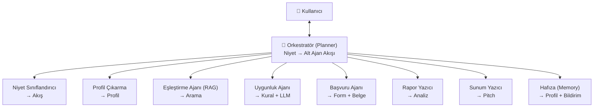

#  🚀 GravioAI

### _Yüzeyin altındaki fırsatı çıkar_

🚀 [**Canlı Demo**](https://gravio-ai-roan.vercel.app) · 📚 [**API Dokümantasyonu**](https://gravioai-backend.onrender.com/docs)

**Developed by**
[Barış Aslan](https://github.com/aslanbaris13) · [Hatice Nur Olgun](https://github.com/haticenurolgun) · [Sena Cindioğlu](https://github.com/SenaCindioglu) · [Ferhat Güdek](https://github.com/FerhatGudek)

---

# Ürün İle İlgili Bilgiler

## Takım Elemanları

| İsim | Rol | GitHub |
|---|---|---|
| **Barış Aslan** | Product Owner | [@aslanbaris13](https://github.com/aslanbaris13) |
| **Hatice Nur Olgun** | Scrum Master | [@haticenurolgun](https://github.com/haticenurolgun) |
| **Sena Cindioğlu** | Developer | [@SenaCindioglu](https://github.com/SenaCindioglu) |
| **Ferhat Güdek** | Developer | [@FerhatGudek](https://github.com/FerhatGudek) |

## Ürün İsmi

**GravioAI**

## Ürün Açıklaması

GravioAI, Türkiye'deki girişimcilerin ve KOBİ'lerin hak ettikleri devlet ve özel sektör desteklerini (hibe, vergi teşviki, bulut kredisi, hızlandırıcı, yatırım ve yarışma fırsatları) bulmasını, uygunluğunu kontrol etmesini ve başvurusunu hazırlamasını sağlayan **çok-ajanlı (multi-agent) bir yapay zekâ asistanıdır.**

Kullanıcı asistanla **konuşarak** profilini oluşturur. GravioAI ardından profili çıkarır, uygun tüm destekleri eşleştirir, uygunluk kontrolü yapar, başvuru taslağı + belge listesi üretir ve son tarih takibi yapar. Her öneri **resmî kaynağa linklidir** (halüsinasyon kontrolü).

> Türkiye'de ~3,9 milyon işletme KOBİ sınıfında (TÜİK, 2024) ve devlet milyarlarca lira, özel sektör (AWS, Google, Microsoft) tek bir girişime 600.000 doları aşan destek sunuyor. Bu kaynakların büyük kısmı farkındasızlık ve başvuru karmaşası yüzünden sahipsiz kalıyor. GravioAI bu boşluğu kapatır.

## Ürün Özellikleri

- 💬 **Konuşma-temelli profil** — form doldurmadan, sohbet ederek işletme profili çıkarma
- 🧩 **Çok-ajanlı orkestrasyon** — uzman ajanlar bir orkestratör tarafından yönetilir
- 🔍 **RAG tabanlı eşleştirme** — pgvector ile anlamsal arama, "sana uygun N destek"
- ✅ **Uygunluk kontrolü** — kural-bazlı + LLM; eksik koşulları açıkça belirtir
- 📝 **Başvuru hazırlığı** — başvuru formu taslağı + belge listesi + iş planı taslağı + şirket sunumu oluşturma
- ⏰ **Son tarih takibi** — kullanıcı profilini hatırlar, fırsatları proaktif bildirir
- 🔗 **Kaynağa linkli cevaplar** — her öneri resmî kaynağa bağlanır
- 🔌 **Modüler konektörler** — yeni program = yeni konektör (KOSGEB, TÜBİTAK, AWS…)
- 🔒 **KVKK Uyumlu Yerel LLM (Gelecek Planı)** — İşletme verilerinin gizliliğini maksimum seviyede korumak amacıyla tamamen yerel (local) LLM modelleriyle çalışma altyapısı
  
## Hedef Kitle

- 🚀 **Erken aşama teknoloji girişimcileri** — bulut kredisi, TÜBİTAK BİGG, hızlandırıcı ve melek yatırım arayanlar (ilk hedef segment)
- 🏪 **Yeni kurulan KOBİ'ler ve esnaf** — KOSGEB ve kalkınma ajansı desteklerine en uygun ama en az bilgiye sahip grup
- 📈 **Büyüme aşamasındaki KOBİ'ler** — yatırım teşvik belgesi, ihracat ve Ar-Ge merkezi teşvikleri arayanlar
- 🧮 **Mali müşavirler & danışmanlık firmaları (B2B)** — müşteri portföyü için aracı olarak kullananlar

## 🧠 Yapay Zekâ Mimarisi

GravioAI "tek bir LLM çağrısı" değil; bir **orkestratör** tarafından yönetilen uzman ajanlardan oluşan **agentic** bir üründür.

| Ajan | Görevi |
|---|---|
| 🧭 **Orkestratör (Planner)** | Niyeti anlar, alt ajanları sırayla/paralel çağırır, sonuçları birleştirir |
| 👤 **Profil Çıkarma Ajanı** | Konuşmadan yapılandırılmış işletme profili üretir |
| 🔍 **Eşleştirme Ajanı (RAG)** | Program DB üzerinde anlamsal arama yapar |
| ✅ **Uygunluk Ajanı** | Program şartlarını profile karşı kural-bazlı + LLM ile değerlendirir |
| 📝 **Başvuru Ajanı** | Form + iş planı taslağı ve belge listesi üretir |
|📊 **Rapor Yazıcı Ajanı** |	Destek programları için detaylı gereksinim analizleri ve değerlendirme raporları oluşturur|
|📽️ **Sunum Yazıcı Ajanı** |	Başvuru süreçleri için projelerin sunum taslaklarını hazırlar |
| 🧠 **Hafıza (Memory)** | Kullanıcı profilini saklar, proaktif bildirim sağlar |

## 🛠️ Teknoloji Yığını

| Katman | Teknoloji |
|---|---|
| Backend | Python 3.12 · FastAPI · Pydantic v2 · Uvicorn |
| Frontend | Next.js 14 (App Router) · React 18 · TypeScript |
| Veritabanı / RAG | Supabase · PostgreSQL · pgvector |
| Kimlik doğrulama | Supabase Auth (JWT/JWKS) |
| LLM | Gemini 3.5 Flash — sağlayıcı-bağımsız katman üzerinden |
| Embedding | Gemini Embedding (`gemini-embedding-001`) |
| Veri toplama (ETL) | BeautifulSoup4 · LangChain (text-splitters, experimental) |
| Belge üretimi | python-docx · python-pptx · pypdf |
| Hız sınırlama | Bağımsız in-memory sliding-window limiter |
| Test | pytest + pytest-asyncio (backend) · Vitest (frontend) |
| CI/CD | GitHub Actions (test + boot smoke test) |
| Dağıtım | Vercel (frontend) · Render (backend) |

---

## Product Backlog URL

🔗 [GravioAI Product Backlog Board](https://hatiicenurolgun.atlassian.net/jira/software/projects/SCRUM/boards/1/reports)

## Demo Video Linki

🔗 [https://youtu.be/30FYHLk4A-M](https://youtu.be/30FYHLk4A-M)

  

<h1>🚀 Sprint 1</h1>

 

## 🎯 Sprint Amacı

Sprint 1'in temel amacı; projenin veri altyapısını oluşturmak, girişim destek programlarını toplamak ve düzenlemek, ortak veri şeması oluşturmak, backend altyapısını kurmak ve semantik arama için gerekli temel bileşenleri geliştirmektir.

---

## 📊 Sprint Özeti

| Başlık | Değer |
|--------|--------|
| Sprint Süresi | 19 Haziran - 5 Temmuz |
| Takım Büyüklüğü | 4 Kişi |
| Toplantı Sayısı | 5 |
| Toplantı Sıklığı | Haftada 2 |
| Planlanan Story Point | 54 SP |

---

<b>📋 Sprint Planlama</b>

### Backlog Düzeni

Sprint backlog'u, projenin ilk sürümünde geliştirilecek kullanıcı hikâyelerine göre oluşturulmuştur. Story'ler daha küçük görevlere (task) ayrılmış ve ekip üyelerine dağıtılmıştır. Önceliklendirme yapılırken sistemin çalışması için kritik bileşenler öncelikli olarak planlanmıştır.

### Sprint Kapsamı

- Girişim destek programlarının toplanması
- Ortak veri şemasının oluşturulması
- Destek programlarının kategorilere ayrılması
- Frontend taslağının oluşturulması.
- Backend altyapısının kurulması
- LLM Provider katmanının geliştirilmesi
- Vector Database kurulumu
- Embedding Pipeline geliştirilmesi
- Eligibility (uygunluk) kurallarının tanımlanması
- Destek programlarının uygunluk kriterleriyle eşleştirilmesi

---

  
<b>💻 Frontend Arayüz Demosu</b>

   

https://github.com/user-attachments/assets/104a3304-f776-4950-9042-9d34f0b2e240

---

<b>📌 Sprint Board Güncellemeleri</b>

Sprint süreci boyunca görev takibi Jira Sprint Board üzerinden gerçekleştirilmiştir.

### Sprint Başlangıcı
 

### Sprint İlerlemeleri

### Sprint Sonu

---

<b>🤝 Sprint Toplantıları</b>

Sprint boyunca haftada **2-3 kez** ilerleme toplantıları gerçekleştirilmiştir.

Toplantılarda;

- Sprint ilerleyişi değerlendirilmiştir.
- Tamamlanan ve devam eden görevler gözden geçirilmiştir.
- Teknik sorunlar değerlendirilmiştir.
- Yeni aksiyonlar belirlenmiştir.
- Jira görevleri güncellenmiştir.

📄 **Toplantı Notları**

Toplantı gündemleri ve alınan kararlar aşağıda verilen linkteki Jira dokümanında yer almaktadır.
https://hatiicenurolgun.atlassian.net/wiki/pages/resumedraft.action?draftId=1

---

<b>✅ Sprint Değerlendirmesi (Sprint Review)</b>

## Sprint Sonu Özeti

| Metrik | Değer |
|--------|--------|
| Planlanan Story Point | 54 SP |
| Tamamlanan Story Point | 54 SP |
| Tamamlanan Görev | 10 |

### Sprint Çıktıları

- Projenin temel veri altyapısı oluşturulmaya başlandı.
- Backend altyapısı ve LLM Provider katmanı geliştirildi.
- Girişim destek programlarının toplanması ve veri şemasının oluşturulması çalışmalarında önemli ilerleme kaydedildi.
- Embedding Pipeline, Vector Database ve Eligibility modüllerinin ilk sürümleri geliştirildi.
- Sprint sonunda tamamlanamayan görevlerin Sprint 2'de devam ettirilmesine karar verildi.

---

<b>🔄 Sprint Değerlendirmesi (Retrospective)</b>

### 👍 İyi Giden Noktalar

- Takım içi görev dağılımı planlandığı şekilde gerçekleştirildi.
- Düzenli sprint toplantıları sayesinde ilerleme sürekli takip edildi.
- Jira üzerinden görev yönetimi etkin şekilde yürütüldü.
- Projenin temel mimarisi ve veri altyapısı başarıyla oluşturulmaya başlandı.

### ⚠️ Geliştirilebilecek Noktalar

- Veri toplama sürecinde ekip üyeleri farklı yöntemler kullandığından veri yapısında tutarlılığı sağlamak zorlaştı.
- Story Point tahminlerinin sonraki sprintlerde daha gerçekçi yapılması hedeflenmektedir.
- Teknik dokümantasyonun sprint boyunca daha düzenli güncellenmesi planlanmaktadır.

### 🎯 Sprint 2 Aksiyonları

Sprint 2 kapsamında farklı veri kaynaklarından veri toplanmasını standartlaştırmak amacıyla ortak bir veri toplama (Data Ingestion) altyapısı geliştirilecektir. Böylece tüm veri sağlayıcıları aynı iş akışını kullanacak, kod tekrarının azaltılması ve bakım kolaylığının artırılması hedeflenmektedir.

-  Semantic search altyapısı geliştirilmeye devam edilecek.
-  Ajan orchestration geliştirmelerine başlanacak
- Frontend geliştirmelerine başlanacak.

---

<h1>🚀 Sprint 2</h1>

 

📋 <strong>Sprint Bilgileri</strong>

 

| Özellik | Açıklama |
|---------|----------|
| **Sprint Tarihi** | **6 Temmuz 2026 – 19 Temmuz 2026** |
| **Sprint Teması** | **Intelligence & Agent Katmanının Geliştirilmesi** |
| **Sprint Amacı** | Kullanıcı profillerini analiz ederek uygun girişim destek programlarını önerebilen, uygunluk değerlendirmesi yapabilen ve doğal dil üzerinden etkileşim kurabilen karar verme altyapısını geliştirmek. Bu sprintte semantik eşleştirme, ajan mimarisi, veri platformu geliştirmeleri ve sohbet sistemi entegrasyonu üzerine çalışmalar yürütülmektedir. |

---

📝 <strong>Sprint Planning</strong>

 

| Metrik | Değer |
|--------|------:|
| **Sprint Süresi** | 14 Gün |
| **Takım Kapasitesi** | 4 Kişi (%100) |
| **Toplam Work Item** | 13 |
| **Planlanan Story Point** | 71 |
| **Tamamlanan Story Point** |71 |

---

📌 <strong>Sprint Backlog</strong>

 

> Sprint backlog aşağıda gösterilmektedir.

---

🤝 <strong>Sprint Toplantıları</strong>

 

Sprint süresince takım üyelerinin yoğun programları nedeniyle yalnızca iki toplantı gerçekleştirilebilmiştir. Görev takibi ve teknik değerlendirmeler Jira ile takım içi iletişim kanalları üzerinden düzenli olarak sürdürülmüştür.

Toplantı gündemleri ve alınan kararlar aşağıda verilen linkteki Jira dokümanında yer almaktadır.
https://hatiicenurolgun.atlassian.net/wiki/x/AYCM

---

 <strong> 📌 Frontend Çıktıları</strong>

 

---

🖥️ <strong>Sprint Değerlendirmesi</strong>

 

### Tamamlanan Çalışmalar

- ✅ Planner / Orchestrator Agent
- ✅ Chat Flow
- ✅ Chat Interface UI
- ✅ Hierarchical Parent-Child Chunking
- ✅ Funding Search System
- ✅ Profile Extraction System
- ✅ Memory Agent
- ✅ Eligibility Checking
- ✅ Eligibility Matching
- ✅ Retrieval Accuracy Testleri
- ✅ Chat Backend Entegrasyonu
- ✅ Veri Toplama ve Normalization İyileştirmeleri

### Alınan Kararlar

> Sprint boyunca geliştirilen tüm modüllerin entegrasyonu başarıyla tamamlanmıştır. Sprint hedefleri doğrultusunda planlanan çalışmalar gerçekleştirilmiş olup, bir sonraki sprintte sistemin performansını artırmaya ve yeni özellikler geliştirmeye odaklanılması kararlaştırılmıştır.

---

✅ <strong>Sprint Review</strong>

 

Sprint planlandığı şekilde başarıyla tamamlanmıştır. Sprint kapsamında hedeflenen tüm geliştirmeler gerçekleştirilmiş; Funding Search System, Profile Extraction System, Eligibility Checking ve Matching modülleri, Memory Agent, Chat Backend entegrasyonu, veri toplama ve normalization iyileştirmeleri ile Retrieval Accuracy testleri tamamlanmıştır. Ayrıca Planner/Orchestrator Agent, Chat Flow, Chat Interface UI ve Hierarchical Parent-Child Chunking geliştirmeleri sisteme entegre edilerek karar verme katmanının ilk uçtan uca çalışan sürümü oluşturulmuştur.

Bu sprint sonunda proje, kullanıcı profilini analiz edebilen, uygun destek programlarını semantik olarak eşleştirebilen, uygunluk değerlendirmesi yapabilen ve doğal dil üzerinden etkileşim kurabilen bütünleşik bir yapıya ulaşmıştır.

---

 

🔄 <strong>Sprint Retrospective</strong>

 

### 👍 İyi Giden Noktalar

- Sprint başlangıcında belirlenen hedeflerin tamamı başarıyla gerçekleştirildi.
- Semantik eşleştirme, uygunluk değerlendirme ve ajan mimarisi bileşenleri planlandığı şekilde ilerledi.
- Planner/Orchestrator Agent, Memory Agent ve Chat sistemi arasındaki entegrasyon başarıyla sağlandı.
- Hierarchical (Parent-Child) Chunking yapısı geliştirilerek retrieval altyapısı güçlendirildi.
- Takım üyeleri farklı modüller üzerinde paralel çalışarak geliştirme sürecini verimli şekilde yönetti.

### ⚠️ Karşılaşılan Zorluklar

- Sprint süresince takım üyelerinin yoğun programları nedeniyle yalnızca iki resmi toplantı gerçekleştirilebildi.
- Farklı modüllerin aynı anda geliştirilmesi entegrasyon sürecinde ek koordinasyon gerektirdi.
- Veri toplama ve normalization süreçlerinde farklı veri kaynaklarından kaynaklanan uyumluluk problemleriyle karşılaşıldı ve gerekli düzenlemeler yapıldı.

### 🚀 İyileştirme Kararları

- Sprint boyunca iletişim Jira ve takım içi mesajlaşma kanalları üzerinden etkin şekilde sürdürüldü. Bir sonraki sprintte daha düzenli ara değerlendirme toplantıları planlanacaktır.
- Ortak geliştirme standartları ve kod yapısının korunması için teknik dokümantasyonun sprint boyunca güncel tutulmasına devam edilecektir.
- Retrieval performansını artırmak amacıyla farklı chunking ve embedding stratejileri değerlendirilecektir.
- Geliştirilen ajan mimarisi üzerine yeni karar verme yetenekleri ve kullanıcı deneyimini geliştirecek özellikler eklenmesi planlanmaktadır.

---

<h1>🚀 Sprint 3</h1>

 

📋 <strong>Sprint Bilgileri</strong>

 

| Özellik | Açıklama |
|---------|----------|
| **Sprint Tarihi** | **20 Temmuz 2026 – 2 Ağustos 2026** |
| **Sprint Teması** | **Uçtan uca akışın tamamlanması, canlıya alma ve teslim** |
| **Sprint Amacı** | Projede geliştirilen tüm modüllerin uçtan uca entegrasyonunu tamamlamak, kullanıcı deneyimini iyileştirmek, sistemin fonksiyonel ve entegrasyon testlerini gerçekleştirerek hataları gidermek ve proje teslimi için gerekli dokümantasyon, demo senaryoları, tanıtım videosu ve canlı sunum hazırlıklarını tamamlamak. |

---

📝 <strong>Sprint Planning</strong>

 

| Metrik | Değer |
|--------|------:|
| **Sprint Süresi** | 14 Gün |
| **Takım Kapasitesi** | 4 Kişi (%100) |
| **Toplam Work Item** | 10 |
| **Planlanan Story Point** | 63 |
| **Tamamlanan Story Point** | 63 |

---

📌 <strong>Sprint Backlog</strong>

 

> Sprint backlog aşağıda gösterilmektedir.

---

🤝 <strong>Sprint Toplantıları/Daily Scrum</strong>

 

> Sprint süresince 2 toplantı gerçekleştirilmiş olup  toplantı notları ve Jira linkleri bu bölüme eklenecektir.

> toplantı dökümanlarının linki: https://hatiicenurolgun.atlassian.net/wiki/spaces/SCRUM/pages/15368193/GravioAI+Sprint+3+Toplant+lar?atlOrigin=eyJpIjoiZDA1ZDA4NmQ1MWNkNDE2NmJjNGIwNTcwNzZiMmQ0YjIiLCJwIjoiaiJ9
>

---

🖥️ <strong>Sprint Değerlendirmesi</strong>

 

### Tamamlanan Çalışmalar
✔️ Chat Arayüzü Tasarımının İyileştirilmesi

✔️ Chatbot Yanıt Yapısının Geliştirilmesi ve Sonuçların Sohbet Arayüzünde Sunulması

✔️ Deadline Takip ve Hatırlatma Ajanının Geliştirilmesi

✔️ Kullanıcı Giriş ve Oturum Yönetimi Sayfalarının Geliştirilmesi

✔️ Kullanıcı Giriş ve Oturum Yönetimi Sayfalarının Geliştirilmesi

✔️ Veritabanı ve Backend Entegrasyonunun Tamamlanması

✔️ Uçtan Uca Sistem Entegrasyonu ve Fonksiyonel Testlerin Gerçekleştirilmesi

✔️ Demo Senaryolarının Hazırlanması ve Doğrulanması

✔️ Canlıya alma ve dökümantasyon içeriklerinin Hazırlanması

### Alınan Kararlar

Projenin son sprinti olması ve doğrudan değerlendirme aşamasına geçilecek olması sebebiyle, bu noktadan sonra canlı sistemde hiçbir kod değişikliği yapılmayarak demo ortamının dondurulmasına karar verilmiştir. Ayrıca, sprint boyunca bireysel yoğunluklardan kaynaklanan iletişim azlığını telafi etmek ve YZTA Bootcamp jüri değerlendirmesine en iyi şekilde hazırlanmak adına, sunum gününden önce Sena, Barış ve Ferhat ile birlikte tam katılımlı bir soru-cevap ve demo provası gerçekleştirilecektir.

---

✅ <strong>Sprint Review</strong>

 

Bu sprint'te belirlenen 10 scrum'ın tamamı başarıyla bitirilmiştir. GravioAI'nin uçtan uca entegrasyonu sağlanmış, fonksiyonel testleri yapılmış ve chatbot arayüzü kullanıcı deneyimini artıracak şekilde iyileştirilmiştir. Kullanıcı giriş ve oturum yönetimi gibi temel modüller sisteme entegre edilirken, deadline takip ajanının geliştirilmesiyle projenin yapay zeka odaklı özellikleri güçlendirilmiştir. YZTA Bootcamp 2026 süreci için kritik olan demo senaryolarının doğrulanması, canlıya alma, dökümantasyon ve proje tanıtım videosu aşamaları da tamamlanarak sunuma tam hazır hale gelinmiştir.

---

🔄 <strong>Sprint Retrospective</strong>

 

Neler İyi Gitti?

Tam Başarı ve Zamanında Teslimat: Planlanan scrumların tamamı hiçbir gecikme yaşanmadan, eksiksiz ve tam zamanında başarıyla tamamlandı. Uçtan uca entegrasyon ve demo hazırlıkları sorunsuz bir şekilde bitirildi.

Neler Geliştirilebilir?

Ekip İçi İletişim: Bireysel görev yoğunluklarının artması nedeniyle bu sprint'te takım içi iletişimimiz normalden daha azdı. Süreçteki tek pürüz bu iletişim kopukluğuydu.

Aksiyon Planı:

Bireysel yoğunlukların yüksek olduğu haftalarda ekipten kopmamak adına, kısa durum güncellemeleri (yazılı asenkron mesajlar veya çok kısa günlük kontroller) yapılarak iletişim akışını canlı tutmaya çalışılacak.

---

**YZTA Bootcamp 2026 — Yapay Zekâ & Veri Bilimi Kategorisi**

_Yüzeyin altındaki fırsatı çıkar._ 🛰️

