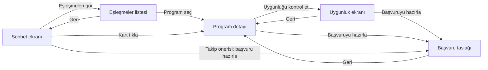
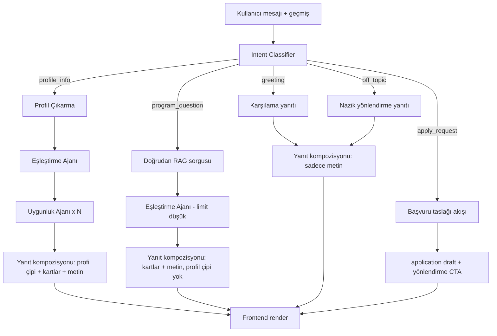

# Kullanıcı Akışı — Sohbet Deneyimi

**Jira**: SCRUM-174 (SCRUM-22 / Chat flow oluşturulması altında)
**Amaç**: Kullanıcı ile asistan arasındaki iletişim akışını, niyet dallanmalarını da kapsayacak şekilde tasarlamak.

---

## 1. Neden bu doküman var

Bugüne kadar orkestratör (`backend/agents/orchestrator.py`) her mesajda **sabit** bir zincir çalıştırıyordu: profil çıkar → eşleştir → uygunluk değerlendir → yanıt üret. Bu, "merhaba" gibi bir mesajda bile tam RAG + LLM maliyeti demek.

SCRUM-96 (Planner/Orchestrator agent) bu zinciri niyete göre dallandıracak. Bu dallanmayı kodlamadan önce, hangi niyetlerin var olduğunu ve her birinde kullanıcının ne görmesi gerektiğini burada netleştiriyoruz — SCRUM-107/108/109'un girdisi bu doküman olacak.

## 2. Uçtan uca ekran akışı (mevcut UI, `frontend/app/page.tsx`)

Bu kısım zaten çalışıyor; değişmeyecek.

## 3. Sohbet içi mesaj akışı — niyet dallanması (SCRUM-96 ile birlikte gelecek)

### Niyet tanımları

| Niyet | Örnek mesaj | Çalışan ajanlar | UI'da görünen |
|---|---|---|---|
| `greeting` | "merhaba", "selam" | yok (sadece reply LLM) | metin balonu |
| `off_topic` | "bugün hava nasıl" | yok (sadece reply LLM) | metin balonu + nazik yönlendirme |
| `profile_info` | "Düzce'de yeni bir AI girişimi kurdum, 3 kişiyiz" | Profil → Eşleştirme → Uygunluk (tam zincir, bugünkü davranış) | profil çipi + program kartları + metin |
| `program_question` | "Ar-Ge hibesi var mı?" | Eşleştirme (düşük limit, profil çıkarmadan) | program kartları + metin |
| `apply_request` | "BİGG'e nasıl başvururum?" | mevcut profil + seçili/ima edilen program → başvuru taslağı | CTA veya doğrudan taslak özeti |

> Not: `unmet`/belirsiz durumlar için classifier güven skoru düşükse (`confidence < eşik`) sistem `profile_info` zincirine düşer (mevcut davranışla aynı) — böylece hatalı sınıflandırma kullanıcıyı hiç yanıtsız bırakmaz.

## 4. Kabul kriterleri karşılığı

- **Intent classification çalışmalı** → §3 tablosu + SCRUM-107
- **Agent routing yapılmalı** → §3 flowchart + SCRUM-108/109
- **Multi-agent flow loglanmalı** → her düğümde (IC kararı, seçilen zincir, süre) `logging` ile kayıt — SCRUM-111

## 5. Sonraki adım

Bu akış onaylandıktan sonra:
1. `02-wireframe.md` — bu dallanmanın ekranda nasıl göründüğü (düşük çözünürlüklü)
2. `03-prompt-akisi.md` — her niyet için classifier ve ajan promptları
3. SCRUM-96 kodlaması bu iki dokümanı doğrudan referans alacak
